<p align="center">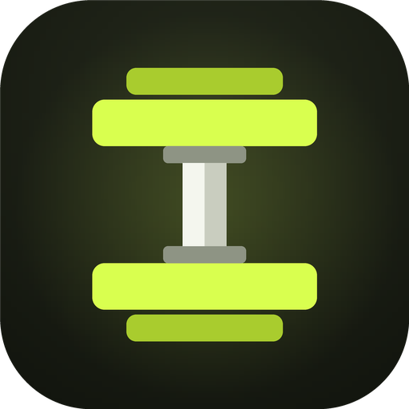</p>

<h1 align="center">Ironlog</h1>

**A strength-training and fitness app for Android and iPhone that plans your workouts, coaches your progression, tracks what you eat and keeps everything on your phone.**

Built by **Venkatesh** ([@VenkateshPanda0](https://github.com/VenkateshPanda0)).

**[⬇ Android APK](apk/ironlog-android.apk)** · **[⬇ iPhone IPA](apk/ironlog-ios.ipa)**: rebuilt automatically after every change ([install steps](apk/README.md)).

<p align="center">
  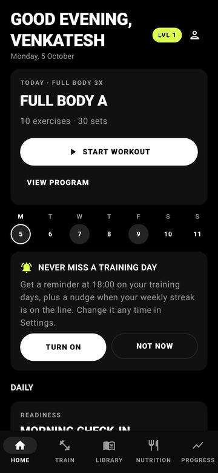
  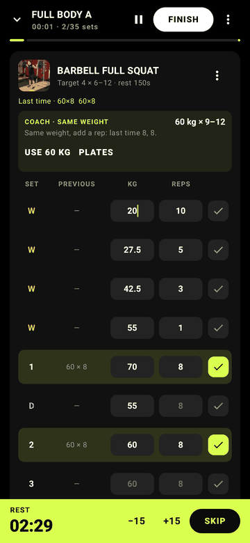
  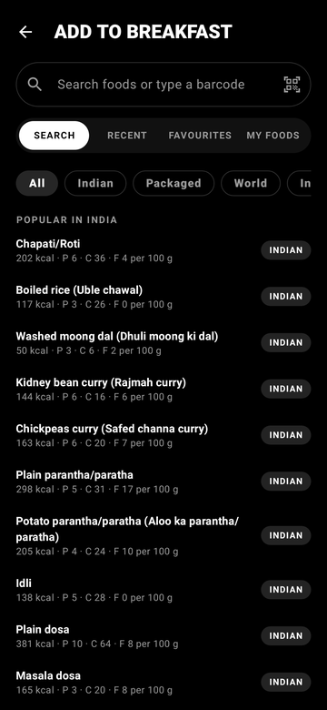
</p>

- **No account, no ads, no tracking.** Your data lives on your phone and in your own phone backup.
- **Works offline.** 876 exercises and 15,800 foods are built in.
- **Made for Indian lifters.** Indian dishes and brands come first in food search, and kg and cm are the defaults (lb and inches are one tap away).

---

## At a glance

| 💪 Training | 🍛 Nutrition | 🏆 Motivation | 🛠️ Engineering |
|---|---|---|---|
| **17** muscle groups trained every week | **15,800** foods offline | **183** achievements in 5 tiers | **151** automated tests |
| **876** exercises | **1,014** Indian dishes | **50** levels (about 2 years of training) | **0** lint errors |
| **873** with photo demos | **1,583** Indian packaged products | **10** goal physiques to compare against | **~23 MB** release APK (R8) |
| **565** animated stick-figure demos | **5,431** world dishes | Streaks for training weeks, food logging and habits | Room schema **v9**, every migration tested |
| **25** movement patterns | **7,793** USDA reference foods | | **0** trackers, **0** ads, **0** accounts |

---

## Contents

- [At a glance](#at-a-glance)
- [Features](#features)
- [Privacy and security](#privacy-and-security)
- [Tech stack](#tech-stack)
- [Build and run](#build-and-run)
- [Testing](#testing)
- [Data sources and licences](#data-sources-and-licences)
- [Project status](#project-status)

---

## Features

### Training: a plan for every day

| | | |
|:---:|:---:|:---:|
|  | 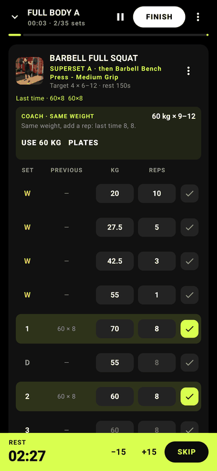 | 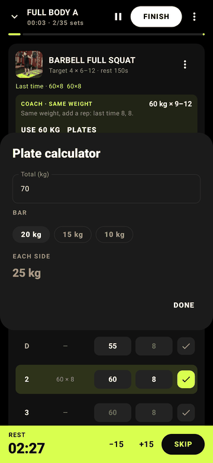 |
| Logger with coach and warm-ups | Supersets | Plate calculator |

- **A program built for you.** A short onboarding asks about your goal, training days, session length, equipment and goal physique. It then creates a split that trains all 17 muscle groups every week, built around staple lifts.
- **Fast set logger.** Each set shows what you did last time. Ticking a set starts the rest timer. Sets can be warm-up, working, drop or rest-pause, and you can swap, reorder or skip exercises and add notes.
- **Progression coach.** Each exercise shows today's target from your history:
  - Hit the top of the rep range on every set and it adds 2.5 kg (5 lb), more for leg lifts and easy sets.
  - Inside the range, it keeps the weight and asks for one more rep.
  - Two sessions in a row short of the range, it deloads to 90%.
  - An optional effort rating (RPE) per set fine-tunes the suggestion.
- **Warm-ups and plates.** One tap generates warm-up sets that ramp to today's weight. The plate calculator shows what goes on each side for kg or lb bars.
- **Supersets and giant sets.** The rest timer starts only after the last exercise of each round.
- **Lock-screen controls.** While you train, a notification shows the next set and the rest countdown, with Done, +30 s and Skip rest buttons.
- **Summary and share.** Personal bests, volume and a shareable workout card at the end of each session.

### Exercise library

| | | |
|:---:|:---:|:---:|
| 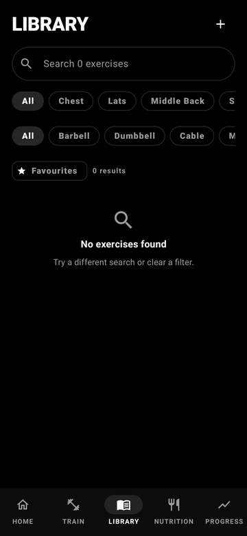 | 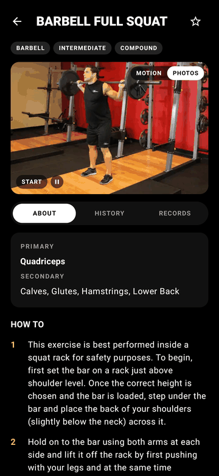 | 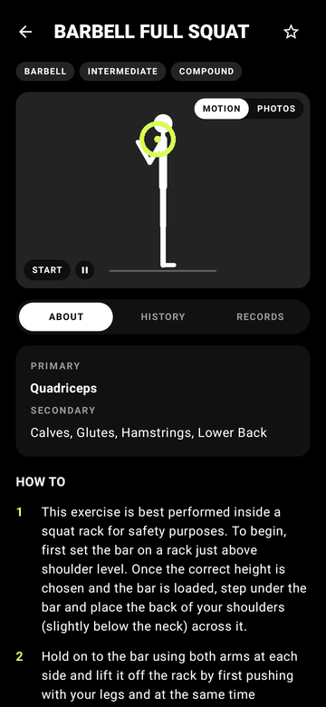 |
| 876 exercises | Photo demos and records | Animated stick figure |

- Search and filter by muscle and equipment, mark favourites, and add your own exercises.
- 873 exercises have start and end photo demos. 565 strength exercises also have an animated stick-figure demo.
- Each exercise shows your history, personal records and estimated one-rep max (1RM) trend.

### Nutrition

| | |
|:---:|:---:|
| 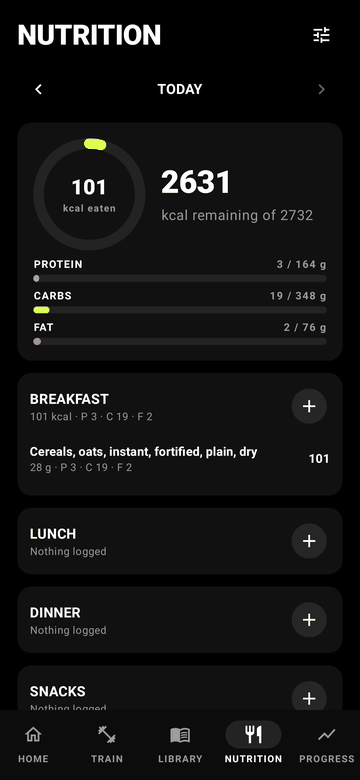 |  |
| Daily diary and macros | Indian dishes first |

- A meal diary with a calorie ring and macro bars, measured against targets calculated for you.
- **15,800 foods offline:**
  - 1,014 Indian dishes (INDB) and 1,583 Indian packaged products.
  - 5,431 world dishes and the full 7,793-food USDA table.
- Online Open Food Facts search and barcode scanning for anything else.
- Portions, recipes, copy a previous day, and a weekly calorie balance.

### Progress and physique

| | | |
|:---:|:---:|:---:|
| 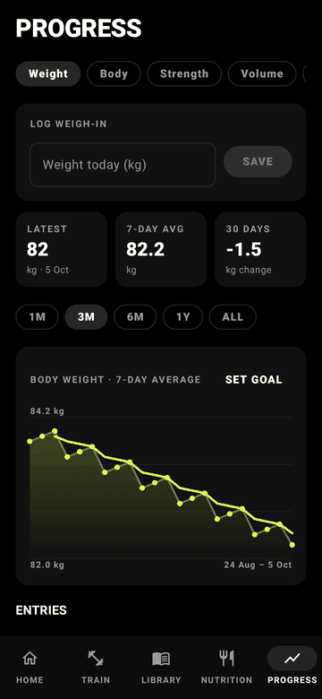 | 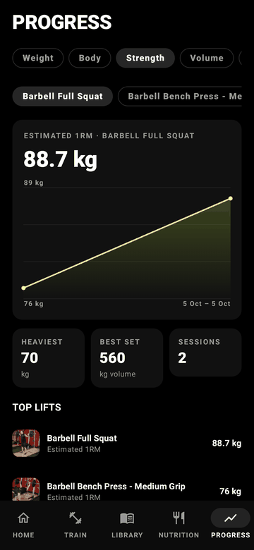 | 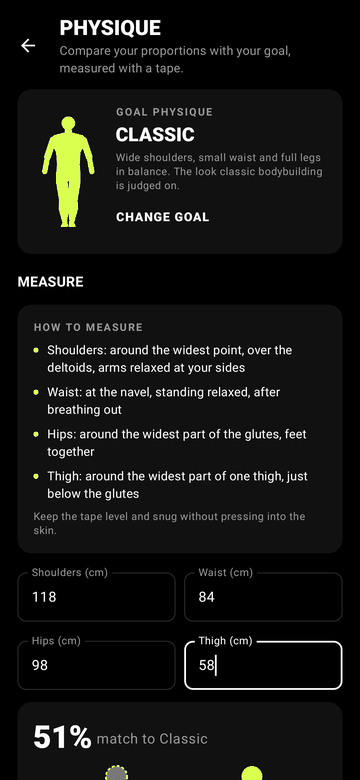 |
| Weight trend | Strength | Physique check |

- **Charts:**
  - Body weight with a 7-day average and goal.
  - Body measurements.
  - Strength and estimated 1RM per lift.
  - Weekly volume and sets per muscle.
  - Cardio and daily trends.
- **Progress photos**, compared side by side.
- **Physique check:** pick one of ten popular goal physiques, enter four tape measurements, and get:
  - a match score and drawn You-vs-goal figures,
  - the muscles to train first,
  - whether to cut, recomp or lean bulk.

  It is rule-based, with no AI model and nothing sent off the phone.

### Daily health and reminders

| | | |
|:---:|:---:|:---:|
| 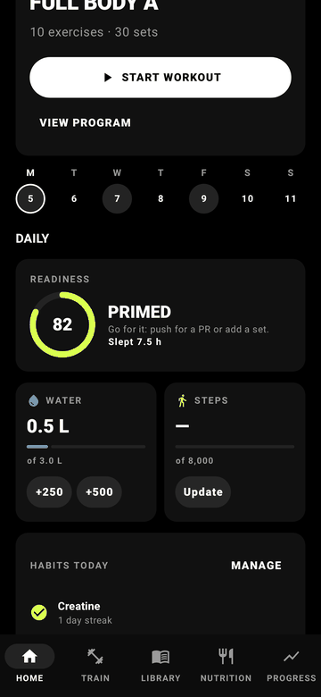 | 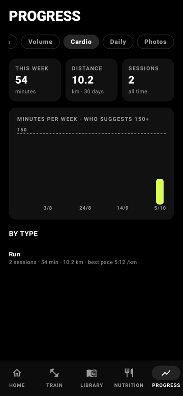 | 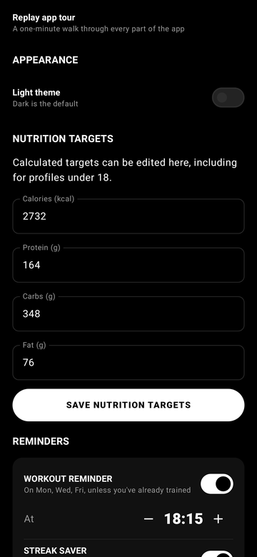 |
| Readiness, water, steps, habits | Cardio | Reminders |

- A morning readiness check-in, plus water, steps, sleep and habit streaks.
- A cardio log with timer, distance and pace.
- Reminders on training days, and a "streak saver" nudge only when today's workout decides your weekly goal.
- **Health Connect** sync: steps and sleep come in; weigh-ins and workouts sync both ways. Your own entries are never overwritten.

### Motivation

| | |
|:---:|:---:|
| 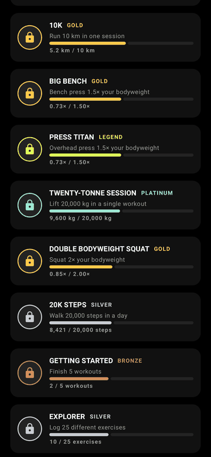 | 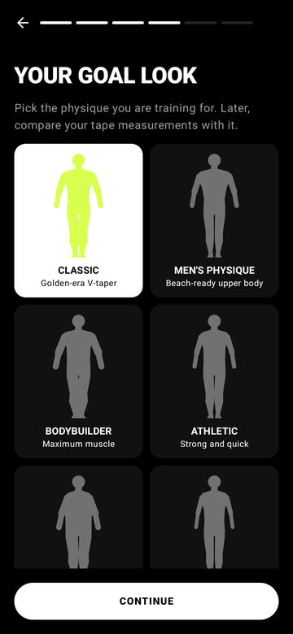 |
| 183 medals | Goal physique |

- 50 levels, tuned by simulation to take about two years of consistent training.
- 183 achievements across Bronze, Silver, Gold, Platinum and Legend, from your first rep to a 300 kg squat.

### Getting started, units and new phones

| | | |
|:---:|:---:|:---:|
| 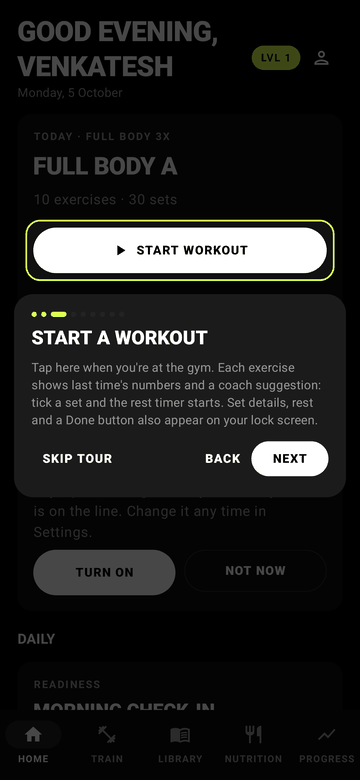 | 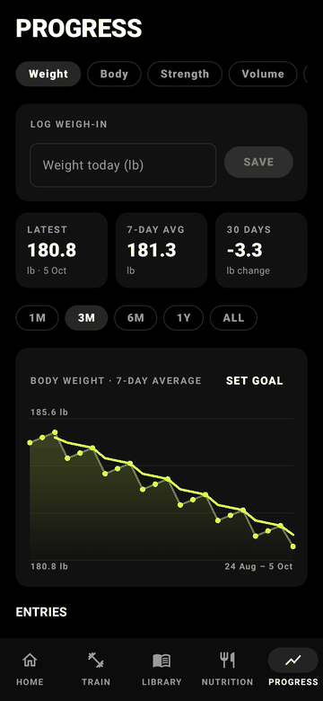 | 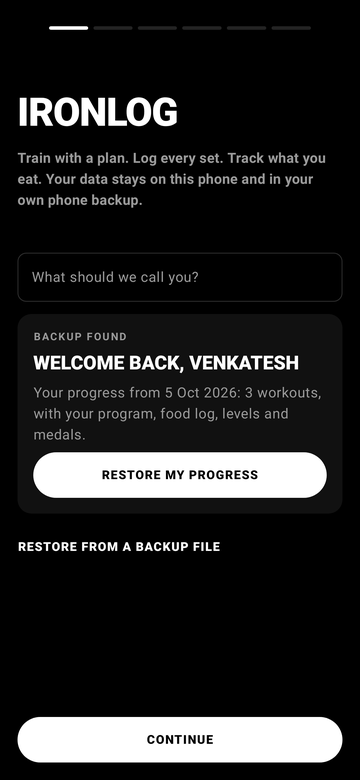 |
| Guided tour | kg or lb | Welcome back on a new phone |

- **Guided tour.** A one-minute walk through the real screens after onboarding. You can skip it at any step and replay it from Settings.
- **Units.** Weights in kg or lb; lengths in cm or inches, with height in feet and inches and distance in miles. Storage stays metric, so switching never changes your data.
- **New phone.** Android's backup keeps a compressed snapshot in your Google account. On a new phone, Ironlog offers "Welcome back" and restores everything in one tap. Phone-to-phone transfer and a single `.zip` export (data plus photos) also work.

---

## Privacy and security

- **Your data stays with you.** Everything is stored on the phone. The only network requests are the food searches and barcode scans you make, sent to Open Food Facts over HTTPS.
- **No account and no analytics.** The app sends no telemetry.
- **Minimal permissions.** Notifications, and Health Connect access only if you turn sync on. No location, contacts or camera permission; barcode scanning uses Google's code scanner, which runs outside the app.
- **Hardened inputs:**
  - **Backups:** size limits (against zip bombs), safe file names (against path traversal) and validation of every value and date.
  - **Network:** responses are size-capped and nutrition values sanity-checked; non-barcode scans are never looked up.
  - **App components:** every component another app can reach checks what it receives, and all pending intents are immutable.
- **Backups contain:** a compressed snapshot in Android's own backup (your Google account), and the `.zip` you export yourself. Nothing else leaves the phone.

## Tech stack

| Area | Choice |
|---|---|
| Language | Kotlin 2.1 Multiplatform (one codebase for Android and iOS), coroutines and Flow |
| UI | Compose Multiplatform (Jetpack Compose on Android), Material 3, Navigation |
| Storage | Room KMP (SQLite, schema v9 with tested migrations), DataStore, Okio |
| Health | Health Connect (Android) |
| Background | AlarmManager reminders and an ongoing workout notification on Android; local notifications on iOS |
| Build | Android Gradle Plugin 8.7, KSP, R8 shrinking; Xcode via XcodeGen for iOS; GitHub Actions for both |
| Tests | JUnit, Robolectric, Compose UI tests, Roborazzi screenshots |

```
app/src/
├── commonMain/   Shared by Android and iOS (about 90% of the code)
│   ├── domain/   Pure Kotlin rules: training, coach, nutrition, achievements, physique, units
│   ├── data/     Room database, repositories, seeds, Open Food Facts
│   └── ui/       Compose screens by feature (home, train, library, nutrition, progress, ...)
├── androidMain/  Health Connect, backups, alarms, notifications, the Android PlatformUi
└── iosMain/      Notifications, photo picker, sharing, storage, the iOS PlatformUi
iosApp/           SwiftUI entry point, app icon and XcodeGen project for the iPhone app
```

## Build and run

Requirements: JDK 17 or newer and the Android SDK (platform 35).

```bash
echo "sdk.dir=/path/to/Android/sdk" > local.properties

./gradlew assembleDebug        # app/build/outputs/apk/debug/app-debug.apk (about 43 MB)
./gradlew assembleRelease      # shrunk with R8 (about 23 MB); sign it before installing
./gradlew installDebug         # install on a connected device or emulator
```

**iPhone** (needs a Mac with Xcode): `brew install xcodegen`, then `cd iosApp && xcodegen generate` and open `Ironlog.xcodeproj`. Xcode compiles the shared Kotlin code itself. GitHub Actions builds an unsigned `.ipa` on every change ([install steps](apk/README.md)).

To publish on Google Play you also need:
- a signing key,
- a privacy policy,
- the Health Connect declaration (steps, sleep and distance read; weight and exercise read and write),
- permission from the INDB authors to redistribute the Indian food data (see below).

## Testing

```bash
./gradlew testDebugUnitTest    # 151 tests: domain rules, database, migrations, backup, sync, UI
./gradlew lintDebug            # 0 errors
```

The UI walkthrough test runs the whole app under Robolectric. It covers onboarding, the tour, a workout, food, cardio, habits, measurements, the physique check, units and settings, and saves screenshots of every screen to `app/build/screens/`. The images in this README come from it.

## Data sources and licences

- **Exercises and demo photos:** [free-exercise-db](https://github.com/yuhonas/free-exercise-db), public domain (Unlicense).
- **Foods:** USDA FoodData Central SR Legacy and FNDDS (public domain).
- **Indian dishes:** Indian Nutrient Databank (INDB), Vijayakumar A. et al., *Curr Dev Nutr* 2024, derived from the ICMR-NIN Indian Food Composition Tables 2017. *Ask the authors for permission before any public release.*
- **Packaged foods:** [Open Food Facts](https://world.openfoodfacts.org) contributors, ODbL 1.0.

Ironlog is an independent project. It is not affiliated with any fitness brand, coach or app, and contains no third-party branded content.

Details: [`docs/SEED_DATA.md`](docs/SEED_DATA.md), [`docs/STATE.md`](docs/STATE.md), [`BUILD_LOG.md`](BUILD_LOG.md).

## Project status

Both apps build on every change: the Android app passes 151 automated tests and lint with 0 errors, and the iPhone app compiles and packages on macOS. Neither has been tested much on physical phones yet. On iPhone, the barcode scanner, Apple Health sync and .zip export are not available yet (type barcodes into search; iCloud backup covers moving to a new iPhone). Next steps:

1. Test on real devices, especially notifications, Health Connect and backup restore.
2. Add the barcode scanner and Apple Health on iPhone.
3. Set up signing and publish on Google Play and the App Store (TestFlight first).

---

<p align="center">Made with care by <b>Venkatesh</b></p>
